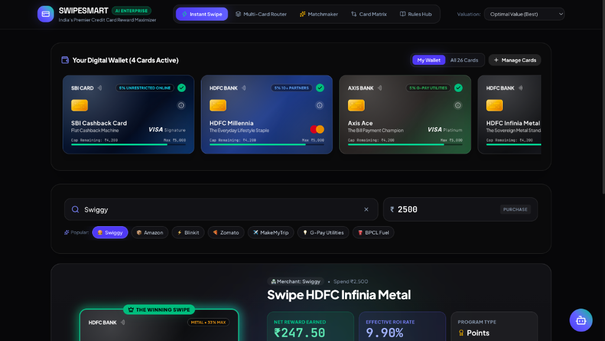
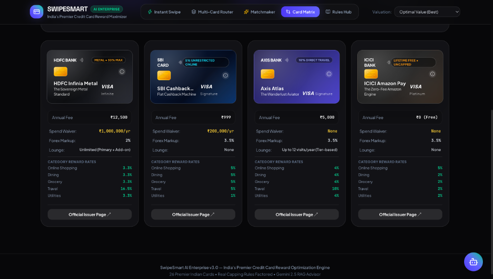
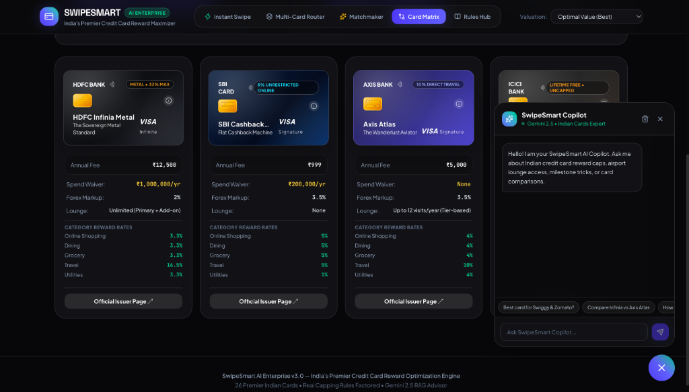

# 💳 SwipeSmart AI (Enterprise Edition) — Credit Card Reward Maximizer

[](https://react.dev/)
[](https://fastapi.tiangolo.com/)
[](https://tailwindcss.com/)
[](https://www.python.org/downloads/)
[](https://aistudio.google.com/)
[](https://github.com/ayush10chauhan1-droid/credit-card-rewards-maximizer/actions)
[](LICENSE)
[](https://www.docker.com/)

**SwipeSmart AI (Enterprise Edition)** is an intelligent credit card reward optimizer, multi-card wallet router, card matchmaker, and AI financial advisor built specifically for the Indian credit card ecosystem.

---

## 📸 Application Showcase

### ⚡ 1. Instant Swipe Recommender & Digital Wallet
*Smart purchase optimizer with real-time vendor detection, monthly capping alerts, and winning card spotlights.*



---

### ⚖️ 2. Card Comparison Matrix
*Side-by-side comparison across 15+ dimensions: annual fees, spend waiver rules, forex markup, lounge quotas, and category rates.*



---

### 💬 3. SwipeSmart AI Copilot (Gemini 2.5)
*Context-aware AI financial advisor retrieving verified knowledge about milestone tricks, capping rules, and reward valuations.*



---

## 🌟 Core Features

### 🛒 1. Instant Swipe Recommender (Single Purchase)
- **Mathematical Optimization**: Analyzes vendor partner rates vs. general category rates vs. fallback rates across 26 premier Indian cards.
- **Realistic Capping Awareness**: Automatically factors in monthly cashback caps (e.g., SBI Cashback ₹5,000/mo, Swiggy HDFC ₹1,500/mo, Axis Ace ₹500/mo).
- **Point Valuation Engine**: Converts non-cashback points into real ₹ based on your redemption preference (Flights/SmartBuy, Air Miles, Vouchers, or Direct Cash).
- **Interactive Visuals & Smart Tips**: Live bar charts, runner-up savings differentials, and annual fee break-even spend calculations.

### 👛 2. Multi-Card Wallet Router (Monthly Budget Optimizer)
- **Multi-Card Routing Engine**: Solves the category assignment problem — tells you *exactly which card in your wallet to swipe for each expense* to maximize total net return.
- **Wallet Synergy Analysis**: Calculates your "Multi-Card Synergy Bonus" (how much more money you make using optimal routing vs. swiping a single card everywhere).
- **Fee Waiver Tracker**: Automatically checks if your routed category spends hit the spend threshold required to waive each card's annual fee.

### 🎯 3. AI Card Matchmaker & Gap Finder
- **Spend Leak Detection**: Flags high-spend categories (> ₹3,000/mo) where you are currently earning < 2.5% return.
- **Net Incremental Profit Ranking**: Simulates adding every unowned card in the database to your wallet and ranks them by *net annual profit after subtracting the card's annual fee*.
- **Lifestyle Filtering**: Filter candidates by Lifetime Free, Pure Cashback, Travel & Lounges, or Super Premium metal cards.
- **One-Click Application Links**: Direct links to official bank issuer application pages.

### ⚖️ 4. Head-to-Head Comparison Matrix
- Compare up to 4 credit cards side-by-side across 15+ dimensions:
  - Annual Fee & Spend Waiver Rules
  - Domestic & International Lounge Visits
  - Forex Markup Fees (Highlighting 0% cards like Scapia & RBL World Safari)
  - Fuel Surcharge Waiver
  - Welcome Perks & Milestone Bonuses
  - Category-by-Category Reward Rates

### 📚 5. Card Rules & RAG Knowledge Hub
- **Semantic Retrieval**: Search official issuer terms, monthly capping limits, lounge access conditions, and fee waiver clauses.
- **Universal Exclusions Reference**: Up-to-date guide on rent, fuel, wallet reload, and tax payment surcharges across Indian banks.

### 💬 6. Floating SwipeSmart AI Copilot
- Context-aware chatbot powered by Google Gemini and RAG knowledge retrieval.
- Answers inquiries regarding lounge access, capping rules, milestone strategies, and card comparisons.

---

## 🏛️ System Architecture

```
┌─────────────────────────────────────────────────────────────┐
│                 Modern React + Vite Frontend                │
│             (Glassmorphism, Tailwind CSS, Lucide)           │
└───────────────┬─────────────────────────────┬───────────────┘
                │                             │
                ▼                             ▼
┌─────────────────────────────┐ ┌─────────────────────────────┐
│    FastAPI REST Backend     │ │         Data Layer          │
│ ├── calculator.py           │ │ ├── cards_db.py (26 cards)  │
│ ├── wallet_optimizer.py     │ │ ├── vendors_db.py           │
│ ├── matchmaker.py           │ │ └── card_rules_knowledge.py │
│ ├── rag_service.py          │ └─────────────────────────────┘
│ └── llm_advisor.py          │
└───────────────┬─────────────┘
                │
                ▼
┌─────────────────────────────┐
│    Google Gemini (2.5)      │
│  - Multi-Turn Reasoning     │
│  - Grounded RAG Generation  │
└─────────────────────────────┘
```

---

## 🚀 Quickstart Guide

### 1. Clone the Repository

```bash
git clone https://github.com/ayush10chauhan1-droid/credit-card-rewards-maximizer.git
cd credit-card-rewards-maximizer
```

### 2. Configure Environment Variables

Create a `.env` file in the project root:

```env
GOOGLE_API_KEY=your_gemini_api_key_here
```

Get a free Gemini API key from [Google AI Studio](https://aistudio.google.com/app/apikey).

---

### 3. Run the Modern React + FastAPI Stack

#### Terminal 1 — Start the FastAPI Backend:
```bash
python3 -m pip install -r requirements.txt
python3 -m uvicorn server:app --reload --port 8000
```
*Backend API will run at `http://localhost:8000` (Interactive docs at `http://localhost:8000/docs`).*

#### Terminal 2 — Start the React Frontend:
```bash
cd frontend
npm install
npm run dev
```
*Frontend will open at `http://localhost:5173`.*

---

### 4. (Optional) Run the Streamlit Version

If you prefer the standalone Streamlit interface:
```bash
streamlit run app.py
```
*Streamlit will run at `http://localhost:8501`.*

---

## 🧪 Automated Testing

Run the full pytest suite to verify calculation, capping, and wallet optimization logic:

```bash
python3 -m pytest tests/ -v
```

All unit tests cover:
- Reward rate priority & vendor partner matching
- Monthly capping logic (SBI Cashback ₹5,000, Swiggy HDFC ₹1,500, Axis Ace ₹500)
- Single purchase card comparison & tie-breaking
- Annual net return & spend-based fee waiver calculations
- Multi-card wallet routing and synergy bonus calculations
- Spend gap analysis and matchmaker ROI ranking

---

## 🐳 Docker Deployment

### Run with Docker Compose

```bash
docker-compose up -d --build
```

---

## 📊 Supported Indian Credit Cards (2026 Database)

| Issuer | Cards Included |
|---|---|
| **HDFC Bank** | Infinia Metal, Diners Club Black, Regalia Gold, Millennia, Swiggy HDFC, Tata Neu Infinity |
| **SBI Card** | SBI Cashback Card, SimplyCLICK, Prime, BPCL Octane |
| **ICICI Bank** | Amazon Pay ICICI, Coral, Sapphiro, Emeralde Private Metal |
| **Axis Bank** | Axis Atlas, Axis Ace, Airtel Axis, Flipkart Axis, Axis Magnus |
| **American Express**| Amex Platinum Travel |
| **IDFC FIRST Bank** | IDFC First Wealth, IDFC First Select |
| **Federal Bank** | Scapia Federal Card (0% Forex) |
| **RBL Bank** | RBL World Safari (0% Forex) |
| **Kotak Mahindra** | Kotak League Platinum, Kotak Zen Signature |
| **IndusInd Bank** | IndusInd Legend, IndusInd Pinnacle |

---

## 🛡️ License

MIT License. Designed for professional financial advisory and reward optimization.
